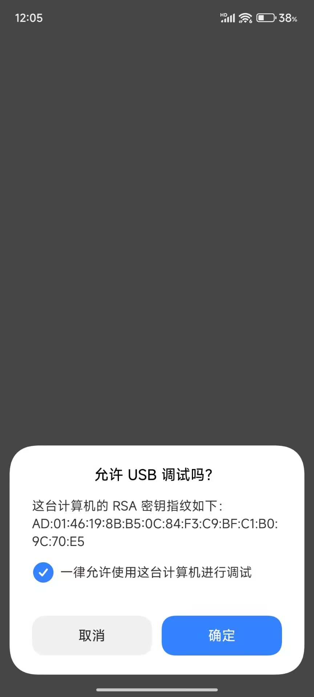
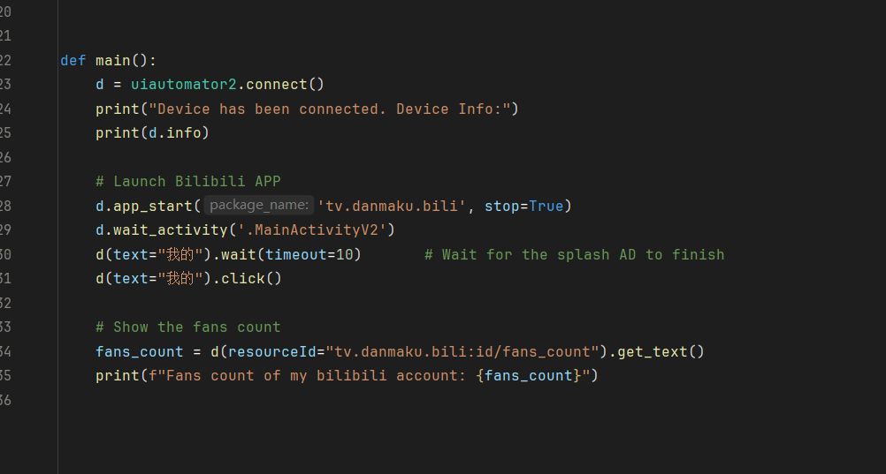
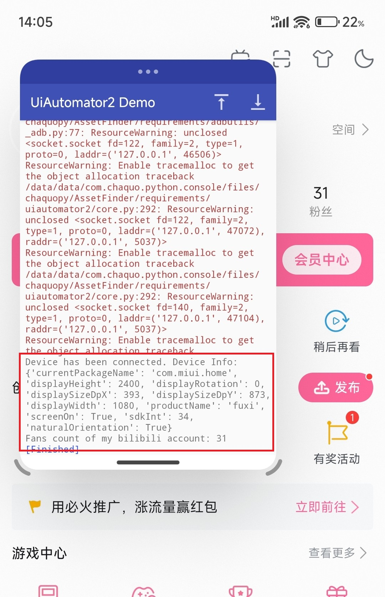

# uiautomator2-android-demo

> Demo project for Python UiAutomator2 running in Android APP, with the support of chaquopy

一个简单的Demo，使用 [chaquo/chaquopy-console](https://github.com/chaquo/chaquopy-console) 项目作为模板，在Python代码中使用UiAutomator2框架连接本机进行自动化操作，并为其配置adb及其二进制依赖，使其可以在单个APP中独立运行，不再需要PC作为控制端。

本项目目前颇为粗糙，只是概念验证证明思路可行，实际场景需要重新编写APP，使用此模板并不合适。

使用的版本号：

- Chaquopy 16.1.0
- Python 3.11
- ADB 1.0.41 Version 35.0.2-android-tools（提取自Termux）

## Screenshots

## More Details

See my blog: 
